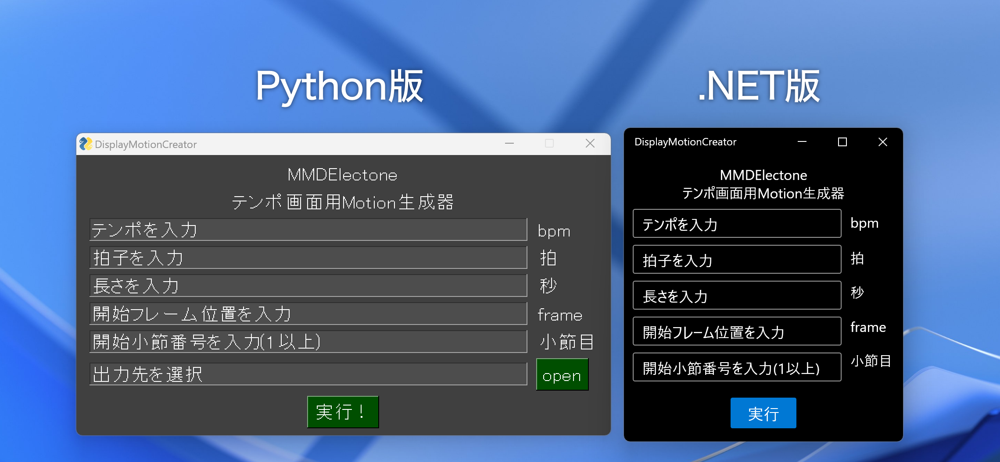

# DisplayMotionCreatorCore

## DisplayMotionCreator .NET Edition

MMDElectoneの小節/ビート制御用モーションを自動生成をします。 

MMDElectoneはこちらで配布しています。
[リンク](https://seiga.nicovideo.jp/seiga/im11383758) 

## 概要

今までの
[DisplayMotionCreator](https://github.com/WimPum/DisplayMotionCreator)
と同様な使い方です。テンポ、拍子、長さだけ入力すれば生成できます。あとの２つは途中から始めるときに使ってください。 
.NET C#+WPFになっています。サポートされるOSはWindows 10 1607以降, Windows 11です。[参照](https://github.com/dotnet/core/blob/main/release-notes/8.0/supported-os.md) 
[ModernWpfUi](https://github.com/Kinnara/ModernWpf)
を採用し、いい見た目になりました。  

## 仕組み

入力された値を元に、キーフレームのリスト(CSVみたいな二次元リスト)を作ったあと、余計なキーフレームを削除し、VMDに変換しています。 
これはオリジナルのほうがわかりやすいかもしれません。

